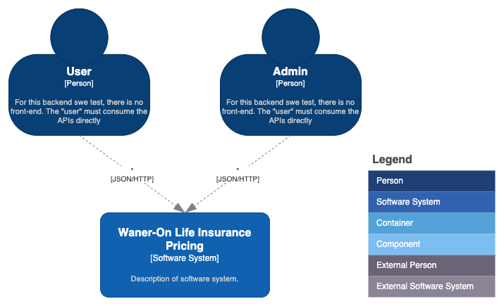
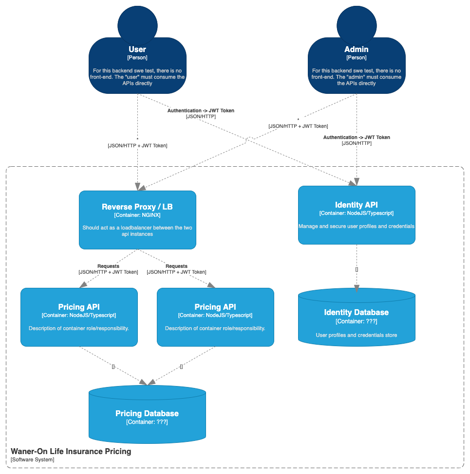

# Stone Seguros - SWE III

A capacidade de contribuição de uma pessoa SWE III é a de realizar entregas de valor participando diretamente do refinamento técnico, podendo trabalhar em problemas com escopo aberto ou pouco definido, contribuindo com as decisões técnicas e fazendo parte do processo de criação da solução. Além de contribuir para a evolução técnica de pessoas juniores.

A pessoa:
- Atua em problemas com escopo aberto ou pouco definido;
- Trabalha principalmente com sua equipe direta e com times de áreas cross, visando a colaboração - entre todos envolvidos para o seu projeto;
- Tem autonomia em seu dia a dia e já não precisa de acompanhamento para tomar decisões acerca de - detalhes da solução;
- Contribui com as decisões técnicas do time
- Faz parte do processo de criação da solução;
- Contribuir para a evolução técnica de pessoas juniores.

Mais informações sobre o cargo podem ser acessadas por aqui
https://stone-payments.github.io/stone-career-framework/swe/swe3


## Case - Waner-On Life Insurance Pricing

Você trabalha para uma InsurTech que chama-se Waner-On Insurance. A empresa vem crescendo exponencialmente, e a base de clientes jovens estão demandando produtos mais modernos e flexíveis que sejam mais aderente com a realidade atual. 

O time de produtos fez um discovery com o publico-alvo, e a chegaram a conclusão que o produto Seguro de Vida da Waner-On precisa ser mais dinâmico na parte de coberturas, permitindo que o cliente escolha quais coberturas quer ter e ter uma precificação mais precisa levando em consideração a idade, ocupação e localização do individuo.

Como SWE III, você recebeu do seu tech leader a demanda de desenhar e implementar a nova funcionalidade de precificação de seguros de vida.

Para esse case, vamos fornecer os dados iniciais, que **devem ser carregados no database de escolha no startup da solução.**

## Requisitos

Verifique a documentação de cada user story clicando no identificador `US-X` de cada uma. Leve em consideração que as US de `admin` podem ser executadas apenas por admins, e as US de `user` podem ser executadas por admins e users.

### Identity API

#### [US-1](/docs/user-stories/identity-api/us-1-user-registration.md) - Eu, como Admin, posso cadastrar novos usuários `admin`, fornecendo o email e senha.

#### [US-2](/docs/user-stories/identity-api/us-2-change-user-role.md) - Eu, como Admin, alterar a role de um usuário para `user` ou `admin`.

#### [US-3](/docs/user-stories/identity-api/us-3-user-login.md) - Eu, como User, posso efetuar um login com a senha fornecida pelo Admin, para gerar um JWT token e consumir a api de precificação.

### Pricing API - Admin

#### [US-4](/docs/user-stories/pricing-api-admin/us-4-create-coverage.md) - Eu, como Admin, posso cadastrar um novo tipo de cobertura, para que seja selecionada durante a precificação.

#### [US-5](/docs/user-stories/pricing-api-admin/us-5-edit-coverage.md) - Eu, como Admin, posso alterar uma cobertura, para que a precificação esteja atualizada.

#### [US-6](/docs/user-stories/pricing-api-admin/us-6-remove-coverage.md) - Eu, como Admin, posso remover uma cobertura, para não permitir mais a precificação com esta cobertura.


### Pricing API - User

#### [US-7](/docs/user-stories/pricing-api-user/us-7-dynamic-pricing.md) - Eu, como User, posso precificar um seguro de vida com base nos parâmetros e coberturas, para fornecer uma precificação precisa e adequada para os clientes.

## Arquitetura

Você deve realizar a implementação completa do `Waner-On Life Insurance Pricing`, o sistema de precificação dinâmica de seguros. 



O sistema Waner-On Life Insurance Pricing deve ser implementado minimamente na seguinte arquitetura:



Não esqueça de complementar os diagramas com o que você desenvolver ;)

### Autenticação

Para este case, você deve utilizar uma autenticação baseada em token assinado com uma chave assíncrona. A `identity api` deve gerar um **JWT** que será utilizado nas chamadas da `pricing api` utilizando **Bearer** scheme. Para simplificar o teste, a `pricing api` pode conhecer previamente a parte publica da chave para abrir e validar os tokens.

## Stack

Você está livre para escolher qualquer biblioteca, database, arquitetura de software que achar melhor, mas lembre que terá que argumentar e defender suas escolhas. Porém temos alguns requisitos técnicos:

- Utilização do NodeJS na versão LTS.
- Implementação do código em Typescript.
- Docker compose para subir toda a solução.


## Instruções

- Para submeter seu case, você deve fazer um fork (caso o desafio tenha sido enviado via email para voce, crie um repositório no seu perfil do github) `privado` deste projeto e compartilhar com o perfil `github.com/rcalabro`.

- Sempre que encontrar `???` na documentação, diagramas, user stories, você deve tomar uma decisão de implementação e atualizar o documento.

- Deve ser fornecido junto com a solução, um arquivo `ARCHITECTURE.md` na pasta `/docs` onde você deve explicar e justificar a solução implementada da forma que achar melhor.

- Deve ser fornecido um arquivo `credentials.json` na raiz do projeto contendo uma credencial com perfil de `user` e uma credencial com perfil `admin`, que serão utilizados pelos testes automatizados durante a avaliação do teste, no seguinte formato (exemplo, os valores devem ser alterados):

```json
{
    "user": { "username": "foo", "password": "bar"  },
    "admin": { "username": "foo", "password": "bar"  }
}

```

- Todos os serviços utilizados para resolução do case devem ser iniciados localmente através do `docker compose`, inclusive os serviços implementados e qualquer database que julgue necessário. Limite o uso de recursos para 2 vCPUs e 4GB de memória através das configurações do docker compose, no máximo.
  
- O teste será executado utilizando o comando `docker compose up`, configure corretamente para que o build e execução das imagens aconteçam corretamente.

- Não se esqueça de fornecer todas as instruções necessárias para execução dos testes implementados. Gerando o report de cobertura em lcov.

- Ao subir a solução, a API de precificação deve rodar em duas instancias, expostas pelo NGINX na porta 3000 do localhost.

- Ao subir a solução, a identity api deve ser exposta na porta 3030 do localhost.

## Critérios de Avaliação

- Entendimento correto dos requisitos e documentação.

- Pontualidade de entrega com o prazo combinado.

- Uso correto dos códigos HTTP para casos de sucesso e erro.

- Qualidade do código. Levaremos em consideração a utilização de padrões de desenvolvimento como GoF Design Patterns, GRASP, DRY, KIS e SOLID. Também avaliaremos a clareza do código, e a quantidade de code smells.

- Utilização correta das estruturas de dados fornecidas.
  
- Argumentação dos trade-offs e escolhas técnicas, como estruturação do projeto, algoritmo para trabalhar com os dados e etc.

- Cobertura dos testes unitários.

- Aderência a stack solicitada.

- Requisitos implementados corretamente (serão validados através de testes de carga e e2e automatizados).

## Bônus

Não consideramos como pontos negativos caso não forem implementados, mas com certeza são bem vindos os seguintes desafios:

- Testes e2e
- Organização dos LOGs
- Otimização de performance
- Otimização de recursos utilizados (CPU e Memória)
- Algo inesperado