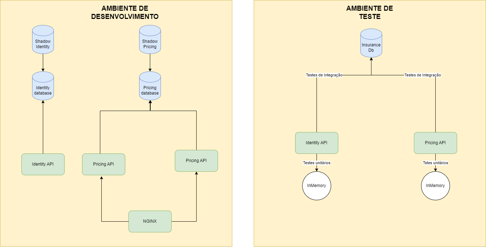
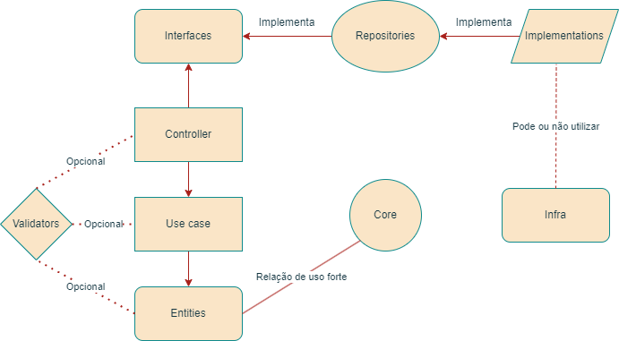

### Considerações

Não foi usado versão LTS do node por ser muito pesado para desenvolvimento e instalação. Levou mais de 5 vezes mais tempo para instalação de dependências e de build de imagens ao trocar para a LTS.

Arquitetura foi feito sugerindo a que foi informada, utilizando express, aplicando vários conceitos de clean architecture, mas sem nenhum modelo de design pattern. Ainda existem algumas melhorias de Clean architecture a serem aplicadas, mas pelo prazo corrido, algumas foram deixadas de lado, como por exemplo, adapters para validators.

Foi utilizado implementações de InMemory repositories para realização dos testes unitários, além de serem muito úteis e fáceis de serem utilizados, são bem rápidos.

Libs como Prisma e Jest foram utilizadas por maior familiariadade.

Alguns problemas de Coverage foram detectados, logo, algumas funções estáticas foram removidas e alguns formatadores ficaram sem coberturas em linhas que não eram possíveis de serem testadas em testes unitários ou erros internos que poderiam ocorrer e não tinham como ser forçados.

**Obs:** CASO algum arquivo fique sem uma cobertura de testes alta, pode ser um bug do Coverage. Caso isso ocorra, favor rodar o comando do jest direcionado para o nome do arquivo. Exemplo:
```bash
npm test -- --coverage CreateUseCase
```

Com isso o Jest irá executar somente aquele teste no qual por algum motivo não entrou no coverage.

Por utilizar prisma, 2 shadow databases foram criados para as migrations.

Conceitos de SOLID aplicados e mais alguns design patterns como:

Factory, Singleton, Proxy, Chain of responsibility, Iterator.

Para Grasp Principles:

Polymorphism, Low coupling, Controller, High cohesion and Information expert.

### Arquitetura

Modelagem de APIs e banco. Foi seguido a modelagem proposta para construção, tendo adicionado um banco para a execução dos testes de forma separada. O banco está levantado no container, mas para evitar a necessidade de modificação de hosts, ele é acessado via localhost pelas envs e os testes executados em modo local também.



Arquitetura APIs




O design da API possui interfaces para implementações e inversão de dependência nos usos. O controller controla quais interfaces e validators utilizará.

As entidades funcionam com o Core, para controle de regras de negócio e de dados. Possuindo também validadores de dados.

A camada de use cases possui os casos de uso utilizados a partir das entidades existentes.

Os repositories implementam as interfaces utilizadas pelos controllers por meio do inversify, assim controlando o que será usado de forma independente.

As implementations são as implementações de repositórios que serão utilizadas, seja na utilização de um banco de dados ou InMemory ou com uso de mocks.

A infra é a camada que determina o tipo de infraestrutura será usada, no caso da aplicação foi implementado uma infra com Prisma e MySql. Nela está implementado a factory para estabelecer o tipo de conexão com o banco será utilizada. Foi feita a factory pois o prisma possui a carência na área de suporte a múltiplos bancos de dados, na hora de seedings e conexões de formas dinâmicas.

