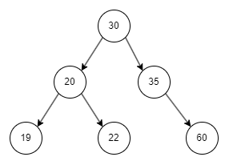

# Waner-On Life Insurance Pricing

## US-7 - Eu, como User, posso precificar um seguro de vida com base nos parâmetros e coberturas, para fornecer uma precificação precisa e adequada para os clientes.

A precificação dinâmica do seguro de vida é onde você deve utilizar os dados `seed` de idade e ocupação, e onde serão utilizadas as coberturas,

Os inputs da precificação são:
- idade do segurado
- ocupação do segurado (código da ocupação)
- coberturas selecionadas
- capital segurado

Para este case considere que o capital segurado não deve ser menor que 10000 e maior que 10000000

O cálculo do prêmio do seguro se dá pela soma dos prêmios de cada cobertura multiplicados pelos fatos de ocupação e idade.

Para calcular o prêmio de cada cobertura você deve considerar o seguinte cálculo
(Capital da cobertura / Capital segurado) * premio da cobertura, porém se a divisão não for inteira, você deve considerar o próximo número inteiro para multiplicar o prêmio.

Tendo esse valor do prêmio da cobertura calculado, você deve multiplicar pelos fatores de ocupação e idade, o payload de resposta deve trazer esses valores calculados por cobertura além do total.

Não deve ser possível precificar um seguro de vida para uma ocupação inativa, ou para idade menores que 18 e maiores que 60 anos.

A idade, para este teste, deve ser utilizada em uma estrutura de árvore balanceada, ou seja, no startup da API você deve carregar os dados de idade em árvore, e durante a precificação, buscar o fator correto navegando na árvore.

Por exemplo, para o seguinte conjunto de idades:
```json
[
  { "age": 19, "factor": 0.8 },
  { "age": 20, "factor": 1 },
  { "age": 22, "factor": 1.25 },
  { "age": 30, "factor": 1.75 },
  { "age": 35, "factor": 2 },
  { "age": 60, "factor": 4 }
]
```

A árvore deve ficar desta forma


O fator deve ser o da idade igual a fornecida ou o próximo fator, por exemplo, com esse conjunto de dados se a idade 33 for fornecida, o fator considerado deve ser da idade 35, que é `2`.

#### Exemplo (considerando os dados `seed`)
Inputs
Idade 26 -> fator encontrado = 1.75 (idade 30)
Ocupação 223280 -> Dentista, ATIVO, fator encontrado 1.02
Capital R$ 100.000
Coberturas:
  - Indenização Especial por Morte Acidental: Premio 20, Capital 15000
  - Invalidez: Premio 10, Capital 10000

**Cálculo**

Indenização Especial por Morte Acidental: 
100000 / 15000 = 6.666
7 * 20 =  140 
140 * 1.75 * 1.02 = 249.9
<br />
Invalidez 
100000 / 10000 = 10
10 * 10 =  100
100 * 1.75 * 1.02 = 178.5
<br />
Nesse caso o valor do prêmio total deve ser 249.9 + 178.5 = `428.4`

**GET** `/quote`

Request Payload
```json
{
  "age": <number>,
  "occupationCode": <string>,
  "capital": <number>,
  "coverages": <stringIds>

}
```

Response Payload - HTTP STATUS `200`
```json
{
  "ageFactor": <number>,
  "occupationFactor": <number>,
  "coverages": [
    {
      "coverageId": <string>,
      "premium": <number>
    },
  ],
  "capital": <number>,
  "premium": <number>
}
```

Error Response - HTTP STATUS `400` - BAD REQUEST, mais mensagem para o campo vazio ou inválido
```json
{
    "error": {
        "code": <number>,
        "message": <string>
    }
}
```

Error Response - HTTP STATUS `401` - UNAUTHORIZED, login não autorizado
```json
{
    "error": {
        "code": <number>,
        "message": <string>
    }
}
```

Error Response - HTTP STATUS `500` - INTERNAL ERROR, algo inesperado aconteceu, seja conexão com banco ou falhas inesperadas
```json
{
    "error": {
        "code": <number>,
        "message": <string>
    }
}
```
